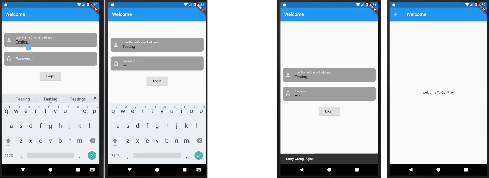

# login_with_actions

A new Flutter project.

## Getting Started

This project is using Form and TextFormField Widgets

with validation of password bigger than 8 charaters

show a SnackBar when Logins is Wrong 

Show anew page when the logins is right

Deleting the password when returning from a navigation 

