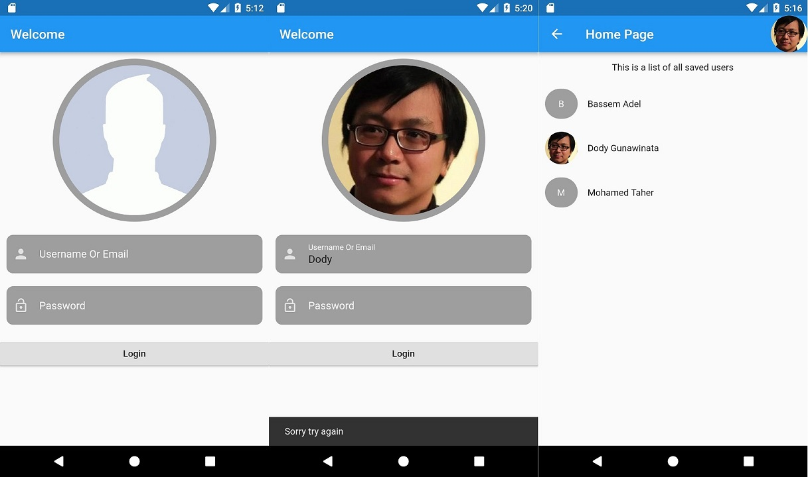
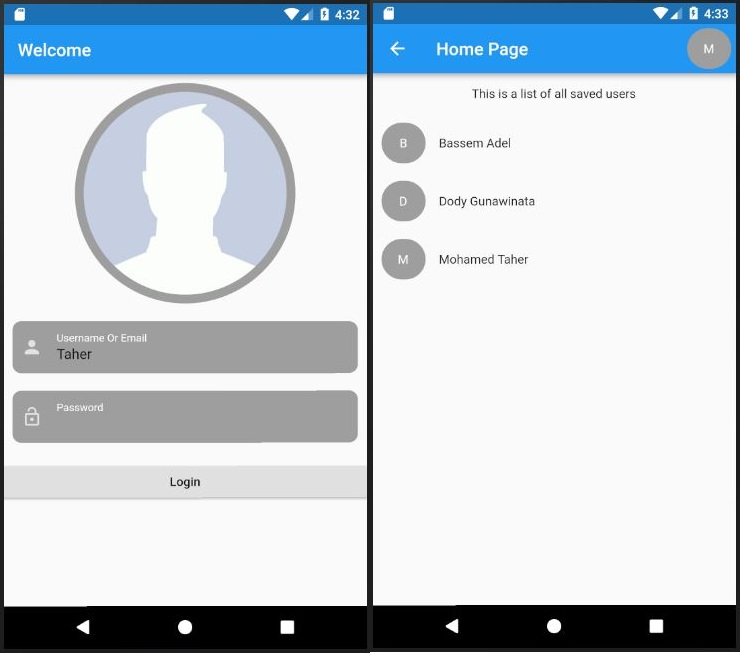

# login_with_actions

A new Flutter project.

## Getting Started

In this project we improve the login form by adding Image widget and ListView widget at the user menu.

It will show a User List when the login is right.
It replaces the user's image (if he has one) when username is right but the password is wrong.
It shows a SnackBar when login is wrong.

It will delete the password after returning from a navigation. 

the following image shows the user with an image login path

the following image shows the user with no image login path

